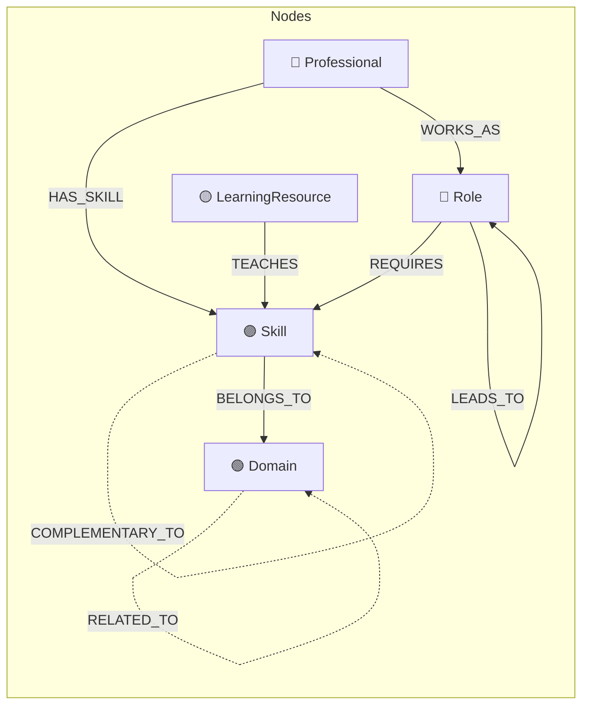

# SkillForge — Career & Skill Intelligence Platform

> **A production-grade graph application powered by [CognoDB Cloud](https://console.cognodb.com) that maps the professional skill landscape — showing how skills connect, what career paths exist, and how to plan your growth through interactive graph visualizations.**


---

## 🎯 Why a Graph Database?

Skills, roles, and learning resources form a **deeply interconnected network** where relationships are the primary data, not an afterthought. A graph database like CognoDB (openCypher over Bolt 5.x) is the right tool because:

| Question | SQL Approach | Cypher (Graph) Approach |
|----------|-------------|------------------------|
| "What's the shortest path from Python to ML Engineering?" | Recursive CTEs across self-referencing join tables, complex and slow | `shortestPath((s1)-[:PREREQUISITE_OF*1..8]->(s2))` — one line |
| "Which skills connect multiple domains?" | Multiple self-JOINs + DISTINCT + subqueries | `MATCH (d1)<-[:BELONGS_TO]-(s)-[:BELONGS_TO]->(d2)` — natural |
| "What career paths exist from Junior Dev to CTO?" | Recursive CTE with cycle detection, easily 20+ lines | `MATCH path = (r1)-[:LEADS_TO*1..6]->(r2)` — trivial |
| "Which skills unlock the most downstream skills?" | Recursive + GROUP BY + window functions | `MATCH (s)-[:PREREQUISITE_OF*1..4]->(d) RETURN s, count(d)` — elegant |
| "Find professionals with similar skills" | Multi-way JOIN through a bridge table + COUNT + HAVING | `MATCH (p1)-[:HAS_SKILL]->(s)<-[:HAS_SKILL]-(p2)` — reads like English |

The **graph model** makes relationship-first queries — the core of career intelligence — **natural, fast, and readable**.

---

## 📊 Data Model



### Node Types

| Node | Key Properties | Count |
|------|---------------|-------|
| **Skill** | `name`, `category`, `difficulty` (1-5), `description`, `icon` | ~80 |
| **Role** | `title`, `level` (junior/mid/senior/lead), `avg_salary`, `domain` | ~30 |
| **Domain** | `name`, `description`, `color` | 10 |
| **LearningResource** | `title`, `type`, `provider`, `url`, `rating` | ~25 |
| **Professional** | `name`, `current_role`, `experience_years`, `location` | ~30 |

### Relationship Types

| Relationship | Direction | Properties | Purpose |
|-------------|-----------|-----------|---------|
| `PREREQUISITE_OF` | Skill → Skill | — | Skill A must be learned before B |
| `COMPLEMENTARY_TO` | Skill → Skill | `strength` | Skills that pair well |
| `BELONGS_TO` | Skill → Domain | — | Categorization |
| `REQUIRES` | Role → Skill | `importance` | Job requirements |
| `TEACHES` | Resource → Skill | — | What a resource covers |
| `HAS_SKILL` | Professional → Skill | `proficiency` | Person's skills |
| `WORKS_AS` | Professional → Role | — | Current position |
| `LEADS_TO` | Role → Role | — | Career progression |
| `RELATED_TO` | Domain → Domain | — | Domain connections |

**Total: ~400+ relationships**

---

## 🏗️ Architecture

```
┌─────────────────────────────────────────────────────────┐
│                    Client (React + Vite)                 │
│  ┌──────────┐ ┌──────────┐ ┌──────────┐ ┌───────────┐  │
│  │Dashboard │ │ Skill    │ │ Career   │ │ Skill Gap │  │
│  │          │ │ Explorer │ │ Paths    │ │ Analyzer  │  │
│  └──────────┘ └──────────┘ └──────────┘ └───────────┘  │
│  ┌──────────────────────────────────────────────────┐   │
│  │       D3.js Force-Directed Graph Visualization    │   │
│  └──────────────────────────────────────────────────┘   │
├─────────────────────────────────────────────────────────┤
│                  API Layer (Express.js)                  │
│  ┌──────────┐ ┌──────────┐ ┌──────────┐ ┌───────────┐  │
│  │ Skills   │ │ Roles    │ │ Graph    │ │ Analytics │  │
│  │ Routes   │ │ Routes   │ │ Routes   │ │ Routes    │  │
│  └────┬─────┘ └────┬─────┘ └────┬─────┘ └─────┬─────┘  │
│  ┌────┴─────┐ ┌────┴─────┐ ┌────┴─────┐ ┌─────┴─────┐  │
│  │ Skills   │ │ Roles    │ │ Graph    │ │ Analytics │  │
│  │ Service  │ │ Service  │ │ Service  │ │ Service   │  │
│  └────┬─────┘ └────┬─────┘ └────┬─────┘ └─────┬─────┘  │
│       └────────────┴────────────┴──────────────┘        │
│                    CognoDB Driver (neo4j-driver)         │
├─────────────────────────────────────────────────────────┤
│            CognoDB Cloud (Bolt 5.x + Cypher)            │
│                 bolt+s://<instance>.cognodb.cloud        │
└─────────────────────────────────────────────────────────┘
```

---

## 📁 Project Structure

```
skillforge/
├── client/                    # React Frontend (Vite)
│   ├── src/
│   │   ├── components/
│   │   │   ├── common/        # Loader, EmptyState, Badge, SearchInput
│   │   │   ├── graph/         # ForceGraph (D3.js), Legend, Tooltip
│   │   │   └── layout/        # Header, Sidebar, Layout
│   │   ├── pages/
│   │   │   ├── Dashboard.jsx  # Metrics, charts, influence rankings
│   │   │   ├── SkillExplorer  # Interactive graph + skill detail panel
│   │   │   ├── CareerPaths    # Role progression tree
│   │   │   ├── SkillGap       # Gap analysis with circular progress
│   │   │   └── LearningHub    # Filterable resource grid
│   │   ├── hooks/             # useApi, useDebounce
│   │   ├── services/api.js    # Centralized API client
│   │   ├── utils/constants.js # Node colors, formatting helpers
│   │   └── styles/            # Design system + page styles
│   ├── index.html
│   └── vite.config.js         # Proxy to backend
│
├── server/                    # Express Backend
│   ├── src/
│   │   ├── config/
│   │   │   ├── env.js         # Environment validation (fail-fast)
│   │   │   └── database.js    # CognoDB driver singleton
│   │   ├── controllers/       # HTTP → Service mapping
│   │   ├── middleware/
│   │   │   └── errorHandler   # Neo4j error → HTTP status mapping
│   │   ├── routes/            # RESTful API routes
│   │   ├── services/          # Parameterized Cypher queries
│   │   └── utils/             # Logger, Cypher record helpers
│   └── index.js               # Server entry with graceful shutdown
│
├── scripts/
│   ├── seed.js                # Populates ~400+ nodes & relationships
│   ├── clear-db.js            # Database cleanup
│   └── verify-connection.js   # Health check
│
├── docs/                      # Extended documentation
├── .env.example               # Environment template
├── .gitignore
├── package.json               # Root workspace scripts
└── README.md
```

---

## 🚀 Setup & Run

### Prerequisites

- **Node.js** ≥ 18
- **npm** ≥ 9
- A **CognoDB Cloud** free instance

### 1. Create a CognoDB Instance

1. Go to [console.cognodb.com/signup](https://console.cognodb.com/signup) and create an account (no credit card)
2. Create a **free (c0) instance** — pick any region
3. **Save your connection details** immediately:
   - URI: `bolt+s://<instance-id>.databases.cognodb.cloud`
   - Username: `cognodb`
   - Password: *(shown once — copy it now!)*

### 2. Clone & Configure

```bash
git clone https://github.com/<your-username>/skillforge.git
cd skillforge

# Copy environment template
cp .env.example .env
```

Edit `.env` with your CognoDB credentials:

```env
COGNODB_URI=bolt+s://your-instance.databases.cognodb.cloud
COGNODB_USERNAME=cognodb
COGNODB_PASSWORD=your-password-here
```

### 3. Install Dependencies

```bash
npm run install:all
```

### 4. Verify Connection & Seed

```bash
# Check CognoDB is reachable
npm run verify-db

# Seed the database with sample data
npm run seed
```

### 5. Start Development

```bash
npm run dev
```

This starts both the API server (`:3001`) and React dev server (`:5173`).

Open **http://localhost:5173** in your browser.

---

## 🔍 Key Cypher Queries

### 1. Shortest Skill Learning Path (Multi-hop, ≥2 hops)
```cypher
MATCH path = shortestPath(
  (s1:Skill {name: $fromSkill})-[:PREREQUISITE_OF*1..8]->(s2:Skill {name: $toSkill})
)
RETURN [n IN nodes(path) | n {.name, .difficulty}] AS skills, length(path) AS hops
```

### 2. Career Progression (Multi-hop)
```cypher
MATCH path = (start:Role {title: $currentRole})-[:LEADS_TO*1..4]->(future:Role)
RETURN [n IN nodes(path) | n {.title, .level, .avg_salary}] AS career_path
```

### 3. Skill Gap Analysis (Anti-join across graph — awkward in SQL)
```cypher
MATCH (target:Role {title: $targetRole})-[:REQUIRES]->(needed:Skill)
WITH needed, CASE WHEN needed.name IN $currentSkills THEN true ELSE false END AS hasSkill
RETURN needed {.name, .difficulty}, hasSkill
```

### 4. Skill Influence (Pure graph metric)
```cypher
MATCH (s:Skill)-[:PREREQUISITE_OF*1..4]->(downstream:Skill)
RETURN s.name, count(DISTINCT downstream) AS influence
ORDER BY influence DESC
```

### 5. Cross-Domain Bridges (Very awkward in SQL)
```cypher
MATCH (d1:Domain)<-[:BELONGS_TO]-(s:Skill)-[:BELONGS_TO]->(d2:Domain)
WHERE elementId(d1) < elementId(d2)
RETURN s.name, d1.name, d2.name
```

### 6. Similar Professionals (Shared skills traversal)
```cypher
MATCH (p1:Professional {name: $name})-[:HAS_SKILL]->(s:Skill)<-[:HAS_SKILL]-(p2:Professional)
WHERE p1 <> p2
RETURN p2.name, collect(s.name) AS shared_skills, count(s) AS overlap
ORDER BY overlap DESC
```

---

## 🎨 UI Features

- **Dashboard** — Animated metric counters, domain distribution bars, influence rankings, salary data
- **Skill Explorer** — Interactive D3.js force-directed graph with zoom/pan, hover highlighting, click-to-explore, and detail sidebar
- **Career Paths** — Multi-hop progression tree with role cards, salary info, and required skills
- **Skill Gap Analyzer** — Select your skills + target role → animated circular progress showing match %, categorized missing skills
- **Learning Hub** — Filterable resource grid with type tabs, ratings, and external links

### Design

- 🌙 Dark theme with navy/charcoal background
- 💜 Purple-to-blue gradient accents
- 🪟 Glassmorphism cards with backdrop blur
- ✨ Smooth animations (staggered fade-ins, count-up metrics)
- 📱 Fully responsive (desktop, tablet, mobile)

---

## 🛡️ Production Practices

- ✅ **Environment validation** — fails fast on missing credentials
- ✅ **Parameterized Cypher** — all queries use `$params`, no string concatenation
- ✅ **Graceful error handling** — Neo4j error codes mapped to HTTP statuses
- ✅ **Connection health checks** — periodic ping with status indicator
- ✅ **Rate limiting** — 100 req/min per client
- ✅ **Security headers** — Helmet.js
- ✅ **Graceful shutdown** — SIGINT/SIGTERM handlers close driver properly
- ✅ **Loading, empty, and error states** — every data-driven component handles all three
- ✅ **Structured logging** — timestamped, leveled logger

---

## 📦 Tech Stack

| Layer | Technology |
|-------|-----------|
| Frontend | React 18 + Vite |
| Graph Viz | D3.js (force-directed) |
| Routing | React Router v6 |
| Styling | Vanilla CSS (custom design system) |
| Backend | Express.js |
| Database | CognoDB Cloud (Bolt 5.x) |
| Driver | neo4j-driver (official) |
| Security | Helmet, CORS, Rate Limiting |

---

## 📄 License

MIT — see [LICENSE](./LICENSE) for details.

---

Built with ❤️ for the [CognoDB Cloud](https://console.cognodb.com) assignment.
